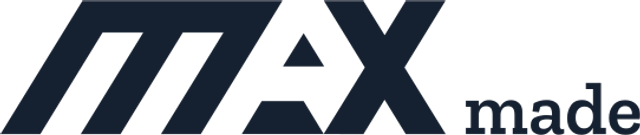
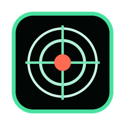
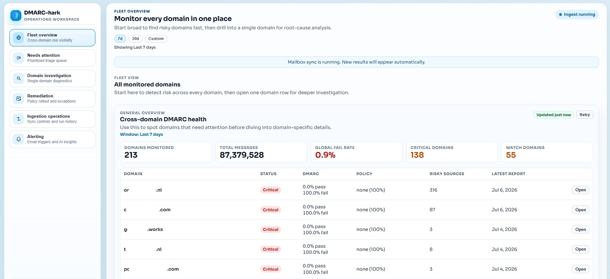
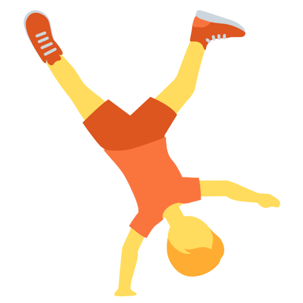
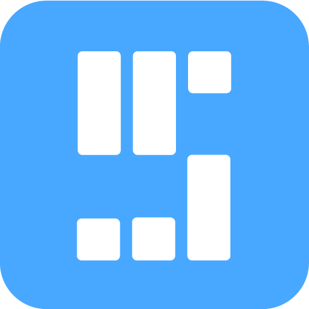
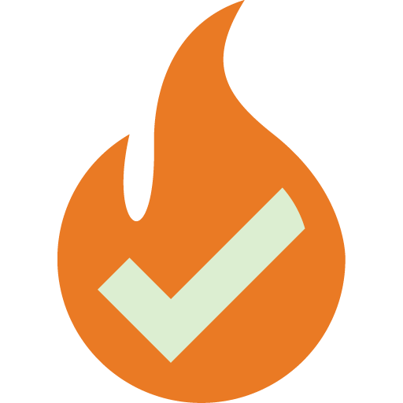

  <picture>
    <source media="(prefers-color-scheme: dark)" srcset="./assets/maxmade-logo-dark.webp" type="image/webp" />
    <source media="(prefers-color-scheme: dark)" srcset="./assets/maxmade-logo-dark.png" type="image/png" />
    <source media="(prefers-color-scheme: light)" srcset="./assets/maxmade-logo-light.webp" type="image/webp" />
    <source media="(prefers-color-scheme: light)" srcset="./assets/maxmade-logo-light.png" type="image/png" />
    
  </picture>

  <h1>Hi, I'm Max.</h1>

  

    <strong>I build useful things for the web, the wall, and the weekend.</strong>
     
    Web developer · builder · photographer · parkour athlete
  

  

    <a href="https://www.maxmade.nl/">See everything on MAXmade ↗</a>
    &nbsp;&nbsp;·&nbsp;&nbsp;
    <a href="mailto:max@maxmade.nl">Say hello ↗</a>
  

---

## Right now

**Building useful software** — I turn messy, real-world problems into focused web apps, APIs, dashboards, and small tools that are fast to use and easy to understand.

**Exploring the edges** — Lately that means email security, Reticulum-native field communication, local-first video processing, parkour communities, and creative projects that sit somewhere between code and art.

## A little about me

I'm Max — a web developer, creator, and parkour athlete from Bergen op Zoom, the Netherlands. I spend most of my time building digital tools and coding ideas into reality, then stepping away from the screen for parkour, photography, music, and creative side projects under the MAXmade name. I like keeping things simple, fast, and fun — in code and in life.

## Selected work

| Project | What it is | Links |
| --- | --- | --- |
|  <strong>Reticom</strong> Python · Reticulum · Android / Windows | Map-first team communication with offline-first Field and Command apps for teams that need maps, voice, text, and shared operational context. | [Project](https://github.com/m-a-x-s-e-e-l-i-g/Reticom) [Releases](https://github.com/m-a-x-s-e-e-l-i-g/Reticom/releases/latest) |
|  <strong>Chronophoto</strong> Python · PySide6 · OpenCV | Turn a short action video into one layered motion photograph, processed privately on your own computer. | [Details](https://www.maxmade.nl/projects/chronophoto) [Source](https://github.com/m-a-x-s-e-e-l-i-g/chronophoto) |
|  <strong>DMARC-hark</strong> Svelte · Python · ClickHouse | A monitoring workspace for domain risk, investigation, and live mailbox ingestion tracking. | [Details](https://www.maxmade.nl/projects/dmarc-hark) [Source](https://github.com/m-a-x-s-e-e-l-i-g/DMARC-hark) |
|  <strong>PKFR.nl</strong> Svelte · SvelteKit | A central hub for the Dutch parkour and freerunning community: spots, events, and people in one place. | [Details](https://www.maxmade.nl/projects/pkfr) [Visit](https://pkfr.nl/) |
|  <strong>JUMPFLIX</strong> Svelte · SvelteKit | Curated parkour and freerunning films, documentaries, and playlists for the community. | [Details](https://www.maxmade.nl/projects/jumpflix-tv) [Visit](https://jumpflix.tv/) |
|  <strong>SessionGoals</strong> Svelte · Supabase | A training companion for athletes who want to set goals, track sessions, and keep moving. | [Details](https://www.maxmade.nl/projects/sessiongoals) [Visit](https://sessiongoals.com/) |
|  <strong>VeryFire.io</strong> Web · SaaS · API | Email verification that helps teams clean their lists, improve deliverability, and make marketing more reliable. | [Details](https://www.maxmade.nl/projects/veryfire) [Visit](https://www.veryfire.io/) |

[Browse the full project shelf ↗](https://www.maxmade.nl/#projects)

## Beyond the build

| Focus | Explore |
| --- | --- |
| **Photography** A chaotic stream of moments captured through my lens. | [Open the gallery ↗](https://www.maxmade.nl/#photography) |
| **Konine Art** Expressive rabbit drawings, printed on canvas and made to be a little strange. | [Visit the gallery ↗](https://www.konine.art/) |
| **Music** Beats, experiments, and unfinished ideas under the MAXmade name. | [Listen on SoundCloud ↗](https://soundcloud.com/m01x) |

  
<strong>More small tools and experiments</strong>

   
  <a href="https://renault-dacia-radio-code-generator.netlify.app/">Renault Radio Code Generator</a> ·
  <a href="https://github.com/m-a-x-s-e-e-l-i-g/renault-radio-code-generator">source</a> 
  <a href="https://github.com/m-a-x-s-e-e-l-i-g/konijn">Konijn Art Gallery</a> ·
  <a href="https://www.konine.art/">live gallery</a>

---

  Have an interesting problem, project, or idea? 
  <a href="mailto:max@maxmade.nl"><strong>Let's make something useful.</strong></a>
    
  <a href="https://www.maxmade.nl/">MAXmade</a>
  &nbsp;·&nbsp;
  <a href="https://github.com/m-a-x-s-e-e-l-i-g">GitHub</a>
  &nbsp;·&nbsp;
  <a href="https://www.linkedin.com/in/maxse/">LinkedIn</a>
  &nbsp;·&nbsp;
  <a href="https://www.instagram.com/the.maxest/">Instagram</a>

